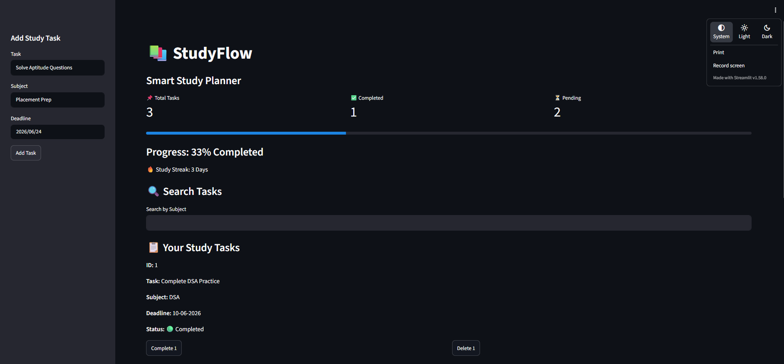

# StudyFlow-Web

StudyFlow-Web is a smart study planner web application built using Python, Streamlit, and SQLite. It helps students manage study tasks efficiently through task tracking, deadline monitoring, progress visualization, and study streak tracking.

## Live Demo

Live Application:
https://studyflow-web-5c8j.onrender.com

## Features

* Add study tasks with subject and deadline
* Mark tasks as completed
* Delete tasks
* Search tasks by subject
* Track study progress
* Deadline reminder system
* Study streak tracking
* SQLite database integration

## Tech Stack

* Python
* Streamlit
* SQLite
* GitHub
* Render

```md
## Project Preview

```md
## Project Preview


```

## Project Structure

```text id="r9qvpx"
StudyFlow-Web/
│── app.py
│── database.py
│── requirements.txt
│── streak.txt
│── studyflow.db
│── README.md
```

## Installation and Setup

### Clone Repository

```bash id="z0kjq7"
git clone https://github.com/Harichandana-30/StudyFlow-Web.git
```

### Navigate to Project Folder

```bash id="hjlwm1"
cd StudyFlow-Web
```

### Install Dependencies

```bash id="3i13w9"
pip install -r requirements.txt
```

### Run the Application

```bash id="a1pd8c"
streamlit run app.py
```

## Future Improvements

* User authentication
* Task priority management
* Personalized study analytics
* Better UI customization
* Mobile responsiveness

## Author

Hari Chandana
